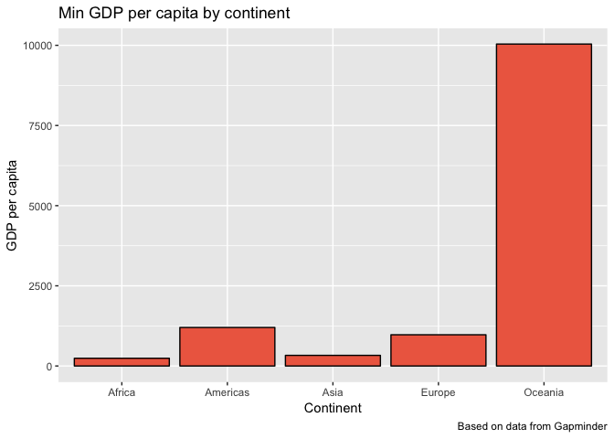
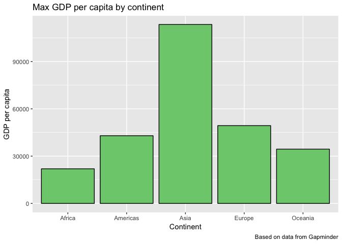
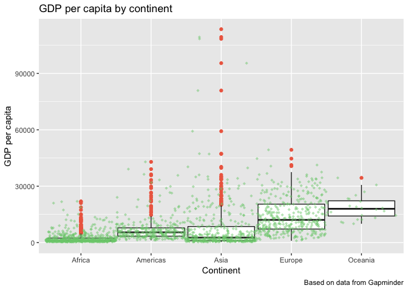
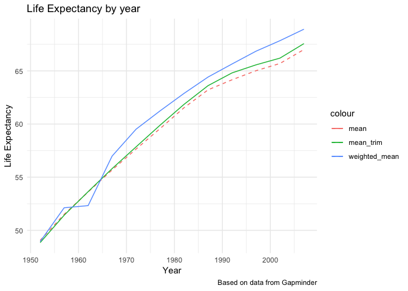
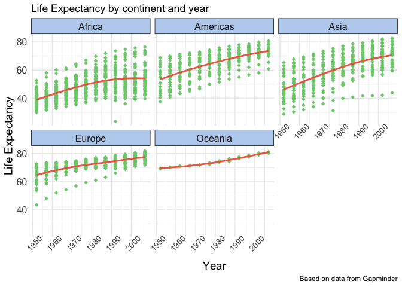

hw03 - Use dplyr and ggplot2 to manipulate and explore data
================
Adam Mattsson
2018-09-28

hw03 - Use dplyr and ggplot2 to manipulate and explore data
===========================================================

The goal is to manipulate and explore a dataset with the `dplyr` package, complemented by visualizations made with \`ggplot2. You can think of this as a deeper version of Homework 02.

Bring rectangular data in
-------------------------

For this assignment I decided to stick with the gapminder data set. To refresh your memory, the gapminder dataset is a massive UN database that compares the populations, gdp per capita, and life expectancy for most countries in 5-year increments between 1952 and 2007. First, let's bring in rectangular data and load, for this assignment, required packages.

Load data required packages:

``` r
#load dplyr via tidyverse metapackage
suppressWarnings(suppressMessages(library(tidyverse)))
#load knitr
suppressWarnings(suppressMessages(library(knitr)))
#load ggplot2
suppressWarnings(suppressMessages(library(ggplot2)))
#load gapminder dataset
suppressWarnings(suppressMessages(library(gapminder)))
```

Task 1: Get the maximum and minimum of GDP per capita for all continents.
-------------------------------------------------------------------------

This information can be retreived using the `group_by()` in combination with `summarize()` functions. This chunk of code first groups the gapminder data frame by continent and then pipes this result into the summarize function. To get max and min of each varable we can use `max()` and `min()` functions. Lastly, lt's output this new data frame as a neat looking table, using the `knitr` package.

``` r
#group gapminder by continent
gapminder_gdp_minmax = group_by(gapminder,continent) %>%
  #create new variables from min/mac GDP per capita
  summarize(max_gdp=max(gdpPercap), min_gdp = min(gdpPercap)) 
#use knitr to output nice looking table
knitr::kable(gapminder_gdp_minmax)
```

| continent |   max\_gdp|    min\_gdp|
|:----------|----------:|-----------:|
| Africa    |   21951.21|    241.1659|
| Americas  |   42951.65|   1201.6372|
| Asia      |  113523.13|    331.0000|
| Europe    |   49357.19|    973.5332|
| Oceania   |   34435.37|  10039.5956|

Now that we have extracted the relevant information from the `gapminder` data set, and compiled it in a new data frame, we are now ready to visualize the data. For this part I decided to create two seperate plots. One for max and one for min GDP per capita. Keep in mind that it would be possible to combine these two variables in the same plot by using, for example the `melt()` function from the `reshape2` package.

Let's visualize the min and max GDP per capita for each continent in the `gapminder` data set in two seperate histograms.

``` r
#plotting min GDP per capita for each continent in the gapminder data set
ggplot(gapminder_gdp_minmax, aes(x = continent, y = min_gdp, fill = gapminder_gdp_minmax$continent)) + 
  #specifying colours of histogram
  geom_bar(stat = "identity", fill = "coral2", colour = "black") +
  #adding labels etc.
  labs(title = "Min GDP per capita by continent", x = "Continent", y = "GDP per capita",caption = "Based on data from Gapminder")
```



``` r
#plotting max GDP per capita for each continent in the gapminder data set
ggplot(gapminder_gdp_minmax, aes(x = continent, y = max_gdp, fill = gapminder_gdp_minmax$continent)) + 
  #specifying colours of histogram
  geom_bar(stat = "identity", fill = "palegreen3", colour = "black") +
  #adding labels etc.
  labs(title = "Max GDP per capita by continent", x = "Continent", y = "GDP per capita",caption = "Based on data from Gapminder")
```



Success! From the figures we can see that Asia has a really diverse GDP per capita range.

Task2: Look at the spread of GDP per capita within the continents
-----------------------------------------------------------------

For this task I chose to subset the data in a similar way that I did in the previous task. I would also like to add some statistic information to this data frame, such as standard deviation, average and quantile informtion. These metrics would be really useful when presenting the results in tables and for graphicial interpretation.

``` r
#create new data frame and group by continent
gapminder_gdp_spread = group_by(gapminder,continent) %>%
  #retreive statistic information and pipe it to new object
  summarize(sd(gdpPercap), average = mean(gdpPercap), IQR = quantile(gdpPercap, 0.75) - quantile(gdpPercap, 0.25))
#use knitr to output nice looking table
knitr::kable(gapminder_gdp_spread)
```

| continent |  sd(gdpPercap)|    average|        IQR|
|:----------|--------------:|----------:|----------:|
| Africa    |       2827.930|   2193.755|   1616.170|
| Americas  |       6396.764|   7136.110|   4402.431|
| Asia      |      14045.373|   7902.150|   7492.262|
| Europe    |       9355.213|  14469.476|  13248.301|
| Oceania   |       6358.983|  18621.609|   8072.258|

Next, let's create a box/jitter plot visualizing the spread of GDP per capita in each continent.

``` r
#plotting gdp per capita vs continent
ggplot(gapminder, aes(x = continent, y = gdpPercap)) +
  #add boxplots with outliers
  geom_boxplot(colour = "gray14", outlier.colour = "coral2", size = 0.5, width = 0.95) +
  #specifying y axis range
  ylim(0, 113524) +
  #add jitter plot
  geom_jitter(colour = "palegreen3", shape = 18, position = position_jitter(width = 0.5, height = 10), alpha = 0.5) +
   #adding labels etc.
  labs(title = "GDP per capita by continent", x = "Continent", y = "GDP per capita",caption = "Based on data from Gapminder")
```

    ## Warning: Removed 1 rows containing missing values (geom_point).



From investegating the table and plot, we can see that Asia is the continent with the most spread out GDP per capita (high standard deviation) compared to other continents. GDP per capita in Asia is also heavily associated with outliers. In contrast, one could say that the GDP per capita in Africa is not very spread out.

Task 3: Compute a trimmed mean of life expectancy for different years
---------------------------------------------------------------------

For this part of the assignment I chose to use a 5% trimmed mean together with a weighted mean (weighting by population). By trimming mean values in the data, we're removing skewed points and this will result in a better accuracy for our mean values. Also, for comparision let's add the standard mean value.

``` r
#group data by year
gapminder_mean = group_by(gapminder, year) %>%
  #get mean trim and weighted mean
  summarise(mean = mean(lifeExp), mean_trim = mean(lifeExp,trim = 0.05), weighted_mean = weighted.mean(lifeExp,pop))
#present result in table using knitr
knitr::kable(gapminder_mean)
```

|  year|      mean|  mean\_trim|  weighted\_mean|
|-----:|---------:|-----------:|---------------:|
|  1952|  49.05762|    48.84636|        48.94424|
|  1957|  51.50740|    51.41927|        52.12189|
|  1962|  53.60925|    53.63838|        52.32438|
|  1967|  55.67829|    55.80484|        56.98431|
|  1972|  57.64739|    57.85226|        59.51478|
|  1977|  59.57016|    59.88981|        61.23726|
|  1982|  61.53320|    61.85009|        62.88176|
|  1987|  63.21261|    63.60734|        64.41635|
|  1992|  64.16034|    64.80741|        65.64590|
|  1997|  65.01468|    65.56467|        66.84934|
|  2002|  65.69492|    66.19818|        67.83904|
|  2007|  67.00742|    67.56459|        68.91909|

Awesome, now let's compare life expectancies over the years, calculated using the two different means (trimmed mean and weighted mean).

``` r
#plot
ggplot(gapminder_mean, aes(year, mean_trim)) +
  #add geom line for mean values and specify linetype (dotted line)
  geom_line(aes(year, mean, color = "mean"), linetype = 2) +
  #add geom line for mean_trim values
  geom_line(aes(color = "mean_trim")) +
  #add geom line for weighted means
  geom_line(aes(year, weighted_mean, color = "weighted_mean")) +
  #adding labels etc.
  labs(title = "Life Expectancy by year", x = "Year", y = "Life Expectancy", caption = "Based on data from Gapminder") + 
  #adding minimal theme to plot
  theme_minimal()
```



From looking at this plot It becomes evident that the life expectancy has indeed increased ver the years. Also, pay attention to how the standard mean values are deviating from the other metrics (trimmed mean and weighted mean).

Task 4: How is life expectancy changing over time on different continents?
--------------------------------------------------------------------------

To answer this question we need to group the data by continent and year. This is easily done by utilizing the same approach as in the previous tasks. To highlight the change in life expectancy over the years for each continent, let's calculate the mean life expectancy for every continent for all the years and show these results in both a table and a plot. To avoid printing all the data in the table we can use `filter()` to only output the entries for Oceania.

``` r
#group data by continent and year
gapminder_lifeExp <- group_by(gapminder, continent, year) %>%
  #get mean values
  summarize(meanlifeExp = mean(lifeExp))
#print results for Oceania
gapminder_lifeExp %>%
filter(continent == "Oceania") %>%
knitr::kable()
```

| continent |  year|  meanlifeExp|
|:----------|-----:|------------:|
| Oceania   |  1952|      69.2550|
| Oceania   |  1957|      70.2950|
| Oceania   |  1962|      71.0850|
| Oceania   |  1967|      71.3100|
| Oceania   |  1972|      71.9100|
| Oceania   |  1977|      72.8550|
| Oceania   |  1982|      74.2900|
| Oceania   |  1987|      75.3200|
| Oceania   |  1992|      76.9450|
| Oceania   |  1997|      78.1900|
| Oceania   |  2002|      79.7400|
| Oceania   |  2007|      80.7195|

let's try to visualize the change in life expectancy over time for each continent. For this part I will use the `facet_wrap` so that we get seperate plots for each continent. Also, let's include a smoother that highlights the average for each year.

``` r
#plotting
ggplot(gapminder, aes(year, lifeExp)) +
  #add facet_wrap to get individual plots for each continent
    facet_wrap(~ continent) +
  #specify opacity and colut of geom point
    geom_point(colour = "palegreen3", alpha = 1, size = 2, shape = 18) +
  #formatting geom smooth
    geom_smooth(colour = "coral2", se = FALSE, span = 1, method = "loess") + 
    #adding labels etc.
    labs(title = "Life Expectancy by continent and year", x = "Year", y = "Life Expectancy", caption = "Based on data from Gapminder") + 
  #specifying theme
  theme_minimal() +
  #formatting theme
  theme(axis.text.x = element_text(size=10, angle = 45), axis.text.y = element_text(size=12), axis.title = element_text(size=14), strip.background = element_rect(fill="lightsteelblue2"), strip.text = element_text(size=12))
```



Great, the plot look just the way that I wanted it to. In a closer look, there seems to be some points that are sticking out. For example, there's one country in Africa around 1990 that shows a considderably lower life expectancy the the rest of the data. Let's find out what country that is.

``` r
gapminder %>%
  #filter on continent and year
  filter(continent == "Africa", year > 1989 & year < 2000) %>%
  #find out min life expectancy for that continent and year
  filter(lifeExp == min(lifeExp))  %>%
  #present output in table
knitr::kable()
```

| country | continent |  year|  lifeExp|      pop|  gdpPercap|
|:--------|:----------|-----:|--------:|--------:|----------:|
| Rwanda  | Africa    |  1992|   23.599|  7290203|   737.0686|

Turns out the country that showed the minimum life expectancy for that year was Rwanda. This sudden drop in life expectancy is probably skewed by the Rwandan genocide that took place in 1994, were an estimated 500 000 - 1 000 000 Rwandans were killed constituting an estimated 70% of the Tutsi population.
